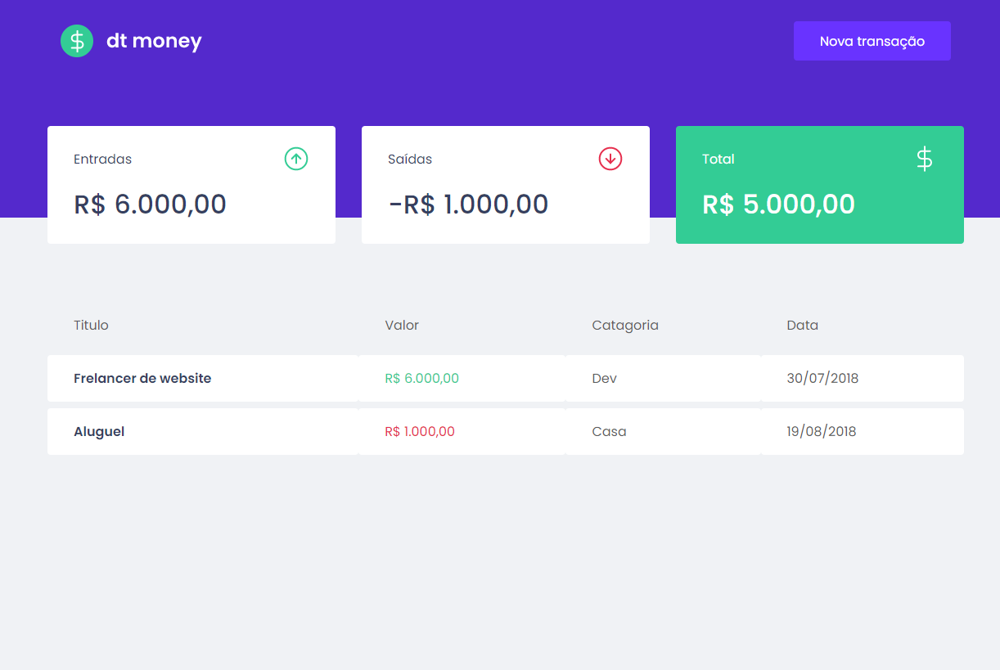
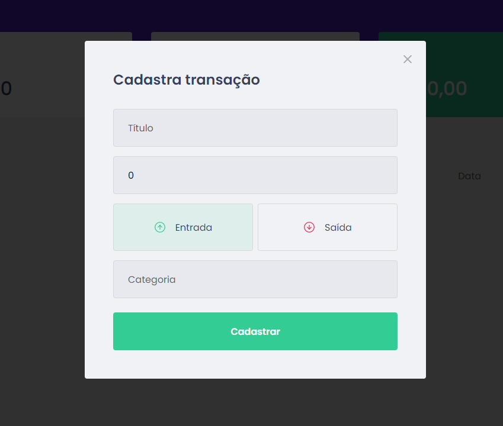

# 💰 dlmoney - seu controle de gastos

Recentemente iniciei meus estudos em React.js, então, este é um projeto desenvolvido durante o
Bootcamp da [Rockeatseat](https://app.rocketseat.com.br).

  

#### 💹 Como usar ?

- Clique em nova transação, ponha os dados requeridos como: title, quantidade de dinheiro, entrada ou saída e categoria.
- automaticamente será contabilizado o total de entrada, saída e saldo
 

  

## 👩‍💻 Durante o desenvolvimento deste projeto, pude praticar:

- Arquitetura de pastas
- Components
- Hooks 

## 🛠 Tecnologias

As seguintes ferramentas foram usadas na construção do projeto:

- HTML5
- Sass
- React.js 
-Typescript

## ✏️ License

#### This project is under the MIT license. Made with 💖 by Leonne Brito.

Thank you! 🌠

